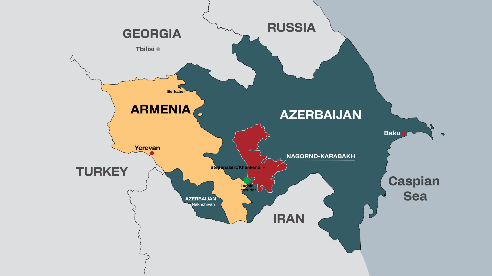

1991년, 소비에트 연방의 붕괴는 세계 전체에 큰 충격을 주었다. 냉전이 종식됨으로써 세계에는 평화가 도래한 것으로 여겨졌으나, 더욱 갈등이 격화된 지역 또한 존재한다.

이번 시리즈에서는 소련 붕괴 이후 가장 갈등이 격화된 지역 중 하나이자, 최근 아제르바이잔과 아르메니아 간 전면전으로 세계의 집중을 받고 있는 나고르노카라바흐에서의 분쟁을 다뤄보고자 한다.

나고르노카라바흐는 캅카스 지역에 위치한 아제르바이잔과 아르메니아 간의 분쟁 지역으로, 국제법적으로 이 지역은 아제르바이잔의 영토이다.
그러나, 이 지역의 주민들이 대부분 아르메니아인이라는 이유로 아르메니아는 나고르노카라바흐가 자국의 영토라고 주장하고 있다.
이러한 문제를 양국은 군사력을 통해 해결하려고 하였고, 1993년 전쟁을 통하여 아르메니아는 이 지역을 군사적으로 점령하여 현재까지 실질적으로 통치하고 있다.

<h4></h4>

19세기까지 이 지역은 민족국가의 정체성이 형성되지 않은 지역으로, 다양한 인종과 종교가 공존하고 있었고, 민족주의가 완성되기 이전에 소련의 지배가 시작되어 민족주의가 제대로 일깨워지지 않은 상황이 지속되었다.

1980년대 말 소련 공산당 서기장 고르바초프의 글라스노스트-페레스트로이카(개방개혁) 정책에 따른 이완된 분위기로부터 양국의 민족주의는 시작되었다.

서명운동과 청원운동과 같은 정치행위로 시작되던 갈등은 아제르바이잔에 거주하던 아르메니아인이 린치당했다는 뉴스가 퍼짐으로부터 양 국가 간 상대 민족에 대한 추방과 범죄로 이어졌다.
이러한 갈등은 양국의 민족주의를 불붙였고, 아르메니아와 나고르노카라바흐 내 급진적 아르메니아 민족주의자들은 이에 호응하여 아제르바이잔<a href="#fn2" id="ref2">2</a>의 구성원이었던 나고르노카라바흐의 일방적 독립을 선언하였다.
이에 그치지 않고 아르메니아 정부<a href="#fn1" id="ref1">1</a>는 1989년 12월, 나고르노카라바흐 자치주의 병합을 소련 연방정부에게 요구하며 캅카스 일대는 일촉즉발의 상황으로 이어졌다.

1991년, 모스크바에서 8월 쿠데타가 일어나며 캅카스에 주둔하고 있던 소련군이 철군하며 이 지역은 힘의 공백이 찾아왔고, 이 시기를 틈타 아르메니아군이 진주하여 나고르노카라바흐와 그 주변의 아제르바이잔 영토의 20%에 달하는 광대한 영토를 점령하였다.
이후 유럽안보협의회의의 중재에 의해 전쟁이 끝나기는 했으나, 이는 양국 모두 전쟁을 지속할 여력이 부족했기에 일어난 일로, 갈등을 덮어놓은 것에 불과하였고, 결국 얼마 전 9월 27일, 대규모 충돌이 다시 발생하고 말았다.

<h4>어째서 갈등이 시작되었는가</h4>

캅카스에는 아르메니아인, 아제르바이잔인 뿐만이 아니라, 그루지야(조지아)인, 오세트인, 러시아인, 탈리시인, 쿠르드족 등 정말 수도 없이 많은 민족들이 혼재되어 있다.
이러한 민족 구성을 보면 이 지역에서 아르메니아와 아제르바이잔만이 이렇게도 격하게 대립하는 것은 다소 특이하게 느껴질 수도 있다.

이는 역사적, 종교적 갈등보다는 정치적 요인에서 기인한다.
1992년, 소련으로부터 독립한 두 국가의 지도자들은 국내의 불안을 잠재우고 결집시키기 위하여 내셔널리즘을 부추기기 시작하였고, 이러한 국가적 정체성과 정치적 지지 확보를 형성시키기 위한 극단주의는
나고르노카라바흐라는 지역을 양국에게 국가통합과 만족적 정체성을 상징하는 지역으로 바꾸었다.
양국의 정치인들과 언론은 자국의 시각에서 바라본 피해자 서사를 형성하기 위하여 총력을 기울였으며, 어떠한 해결책도 통하지 않는 상황을 형성하였다.

{/* 
## 종교만으로는 전쟁이 일어나지 않는다
나고르노카라바흐 분쟁의 또 다른 내재적 동인은 경제적 이해이다.
분쟁의 씨앗은 민족적, 종교적 감정이었을지언정, 갈등이 지속되는 까닭에는 경제적 이유도 밀접하게 연관되어 있다.

이스라엘과 아제르바이잔 간의 군사 및 경제적 밀착은 이 분쟁이 단순한 민족적, 종교적 갈등을 넘어서는 현실을 보여준다. 
특히 2020년 2차 나고르노카라바흐 전쟁에서 이스라엘이 아제르바이잔에 판매한 무인항공기가 전투의 성패를 결정짓는 중요한 요소가 되었다.
이스라엘로부터 구입한 무인항공기는 아제르바이잔 군대에게 예상 이상의 효과를 발휘하며 전장에서 큰 우위를 점하게 했다. 
아르메니아는 이러한 지원에 대해 강력히 항의했으나, 이스라엘과 아제르바이잔 간의 관계는 정치적 및 경제적 이해에 기반하고 있어 종교적 요소가 크게 작용하지 않았다. 
이스라엘은 인근 적대적인 산유국들로부터 자국의 에너지 안보를 확보하기 위해 아제르바이잔으로부터 석유를 수입하고 있으며, 동시에 자국 방산업체에 대한 주요 시장으로서 기능하고 있다. 
이러한 상황은 나고르노카라바흐 문제를 기독교와 이슬람 간의 종교적 대립으로 단순화하는 것에 대한 의문을 제기한다.

마지막으로, 나고르노카라바흐 분쟁의 지속적인 군사적 충돌과 정치적 긴장은 주변 강대국들의 지정학적 이해와 세력 충돌에서 비롯된다.
러시아와 터키는 각각 아르메니아와 아제르바이잔을 지원하며 갈등을 심화시키고 있다.
러시아는 전통적으로 아르메니아의 보호자로 여겨졌으나, 최근에는 그 역할이 약화되고 있는 반면, 터키는 아제르바이잔을 적극 지원하며 지역 내 영향력을 확대하고 있다. 
결론적으로, 나고르노카라바흐 문제는 단순한 민족 및 종교 갈등을 넘어서서 경제적 이해관계와 주변 강대국들의 정치적 개입으로 복잡하게 얽혀 있는 현대 국제정치의 한 단면을 보여준다.
이러한 복합적인 요인들은 갈등 해결을 더욱 어렵게 만들고 있으며, 앞으로도 지속적인 주목과 연구가 필요한 주제이다. */}

