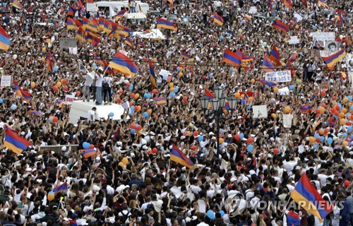
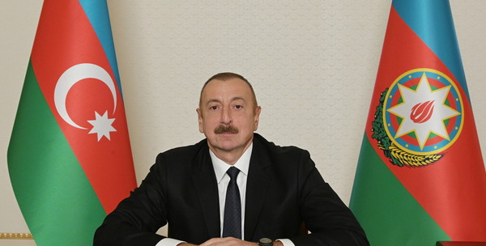

캅카스에서의 휴전 협정이 일주일을 채 넘기지 못하고 휴짓조각이 되어버렸다. 아제르바이잔은 이 기회에 아르메니아를 멸망이라도 시킬 것처럼 공세를 지속하고 있고,
아르메니아는 막을 여력이 없어 국제사회의 지원을 호소하고 있다.
오늘은 이 전쟁이 일어난 것에 대한 각국의 국내정치적 배경에 대하여 말해보고자 한다.

<h4>민주혁명의 비극</h4>

2018년, 벨벳 혁명으로 불리는 민주화 혁명이 일어나며 아르메니아는 독재 정권을 몰아내고 니콜 파시냔이 이끄는 민주 정권을 수립한다.
하지만, 민주 정권이 국민적 지지를 얻기 위하여 실행한 정책의 노선들은 아르메이아에게 결코 좋은 결과로 돌아오지 못했다.

아르메니아는 아제르바이잔에 비하여 군사적, 경제적으로 절대적 열세 상태에 놓여있다.
허나, 주변의 강대국인 러시아, 이란과의 외교 관계가 더 좋다는 점으로 인하여 아르차흐 공화국이라는 체제를 유지시킬 수 있었다.

하지만, 파시냔 대통령 집권 이후, 대중적 지지를 얻기 위하여 나고르노카라바흐 문제에 대한 국수적 호소를 통한 정권에 대한 결집력을 강화시키고자 하였다.
더하여, 외교적 노선의 친서방으로의 전환, 더 나아가 독립국가연합 탈퇴 안건 제시 등으로 인한 러시아와의 관계 악화 등 현실을 외면한 다양한 급진적인 정책을 내놓았다.
이러한 급진적인 변화는 아르메니아에게 심각한 결과를 초래했으며, 결국 아제르바이잔의 군사적 행동을 촉발하는 빌미가 되었다.

<h4>위기는 독재를 정당화한다</h4>

반면 아제르바이잔은 나고르노-카라바흐 문제에 대해 보다 복합적인 이해를 가지고 있다.
아제르바이잔은 1993년, 소련 시기에 헤이다르 알리예프가 집권한 이후 그의 아들 일함 알리예프가 권력을 이어받아 장기 독재 체제를 유지하고 있다. 
이들은 나고르노-카라바흐 문제를 장기집권에 대한 국민적 반감과 정당성 결여를 상쇄하기 위한 수단으로 활용하였다. 

아제르바이잔은 1차 나고르노-카라바흐 전쟁에서의 패배로 인해 약 50만 명의 자국민이 거주지를 떠나야 했고, 영토의 약 20%를 상실한 사실을 국가적 수치로 간주하고 있다. 
이는 아제르바이잔 정부에게 자력으로 영토를 회복해야 한다는 강한 당위성을 부여하며, 이러한 배경 속에서 아제르바이잔은 군사적, 외교적 역량을 집중하여 나고르노-카라바흐 탈환을 위한 전략을 추진하고 있다.

또한, 아제르바이잔은 수출의 95% 가량을 에너지 수출에 의존하고 있기에 나고르노-카라바흐 문제 해결에 대한 필요성을 느끼고 있다. 
이 지역은 바쿠에서 채굴된 석유와 천연가스 파이프라인이 터키와 유럽으로 연결되는 전략적인 위치에 있어 경제적으로 매우 중요한 곳이며,
국제 유가 변동으로 인한 자국의 경제적 분안이 조성될 때마다 나고르노-카라바흐 문제를 정부에 대한 불만을 달래는 수단으로 활용해 왔다.
아제르바이잔 정부는 꾸준히 미디어를 통해 나고르노-카라바흐를 점령한 아르메니아계의 무력 사용을 보도함으로써 국민들에게 전쟁의 정당성을 각인시켰다. 
한 예로, 2016년에 일어난 전투는 정부의 재정 위기로 인플레이션과 실업률이 치솟던 시기에 발생했는데, 이는 정부가 국민들의 불만을 잠재우려는 전략으로 볼 수 있다.

결과적으로, 아르메니아-아제르바이잔 간 분쟁에는 상호간 대립을 국가통합과 정치적 정당성의 원천으로 활용한 양국 정치인의 전략이 작용하였다.
아르메니아는 나고르노카라바흐에 대한 지배권의 유지와 외교적 노선 변화를 동시에 꾀하다 자국의 정치경제적 불만을 외부로 돌리려고 하던 아제르바이잔과의 충돌이 일어났다고 볼 수 있다.